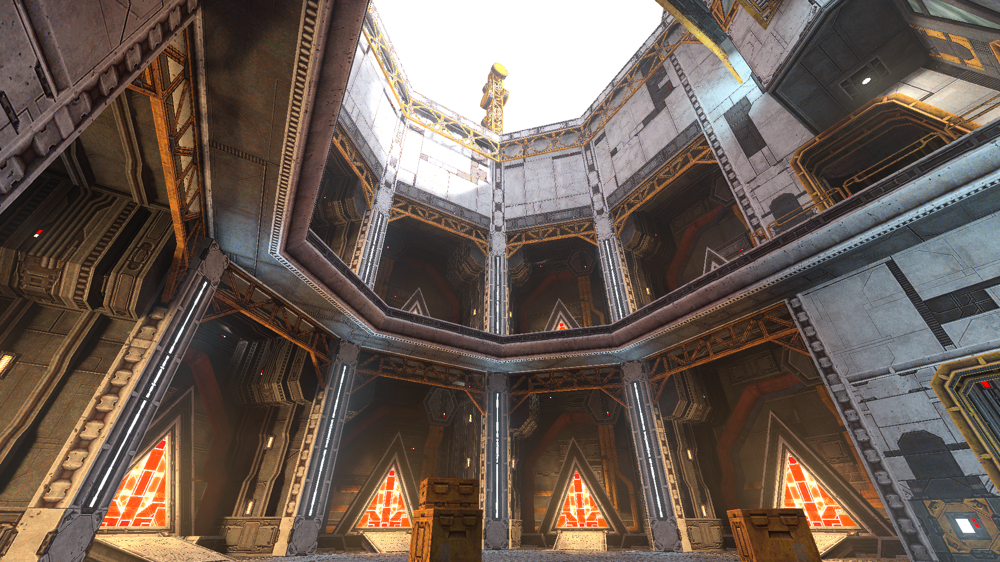
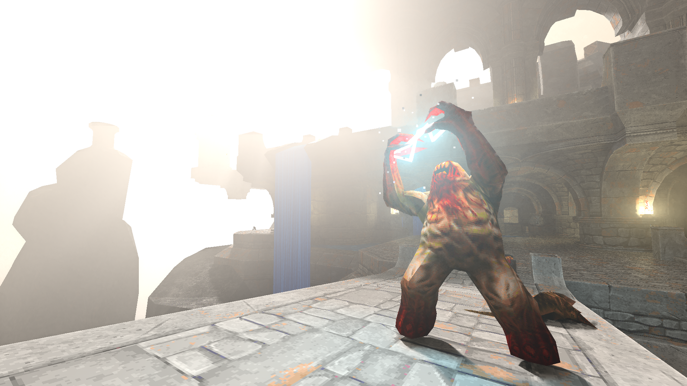

# Merian 🎨

~ _A Vulkan development framework._ ~

<p align="middle">
  
   
   
   
</p>

Merian is split into multiple components:

 - [`merian`](https://github.com/LDAP/merian/tree/main/include/merian): Provides core abstractions and utilities (Vulkan context, memory allocation, configuration, IO, ...).
 - [`merian-graph`](https://github.com/LDAP/merian/tree/main/include/merian-graph): Implements an extensible Vulkan processing graph. Already implemented nodes can be found [here](https://github.com/LDAP/merian/tree/main/include/merian-graph/nodes).
 - [`merian-shaders`](https://github.com/LDAP/merian/tree/main/include/merian-shaders): Reusable shader code plus the scene representation, glTF/FBX loaders, material system and texture management.

Merian aims for compatibility with Windows, Linux as well as all major GPU vendors.

## Getting started

### Build

```bash
git clone --recursive https://github.com/LDAP/merian
# optionally clone any plugin you want to use into subprojects:
# cd subprojects
# git clone https://github.com/LDAP/merian-plugin-quake
meson setup build
# You can enable / disable some feature by appending -Dfeature_name=enabled, for example glslang (GLSL compiler), glfw (windowing), sdl (windowing+audio), performance_profiling, tinygltf, ufbx, pbrt (scene formats) or switch to a debug build with --buildtype=debug/debugoptimized.
cd build
meson compile
meson devenv # needed on Windows to find all the dlls
# this builds all the shared libraries and a runner for merian graphs:
./merian-graph-run
```

### Examples: merian-graph-run

merian ships a generic executable `merian-graph-run` that loads a [`merian-graph`](https://github.com/LDAP/merian/tree/main/include/merian-graph) from a JSON file and runs it (`merian-graph-run [options] [graph.json [args...]]`; without an argument it starts with an empty graph). Options:

- `--loglevel=<trace|debug|info|warn|error>`: log verbosity.
- `--plugin-path=<dir>`: extra plugin search directory (repeatable).
- `--validation=<on|off|ifdebug>`: Vulkan validation layers (default: `ifdebug`).
- `--merge <file.json>`: deep-merge a JSON file into the config (repeatable, last wins).
- `--<name> <value>`: set an override declared in the graph's `cli` block (see the per-graph options below).
- `--help`: with a `graph.json`, also lists that graph's `cli` overrides.

It ships with a set of built-in nodes and can be extended with additional node sets and renderers through its [plugin system](#plugins).

Example graphs for `merian-graph-run` are in the [`examples`](https://github.com/LDAP/merian/tree/main/examples) folder:

- [`hdr_viewer.json`](https://github.com/LDAP/merian/tree/main/examples/hdr_viewer.json): a tone-mapped HDR image viewer — `merian-graph-run examples/hdr_viewer.json <image.hdr>`.
- [`shadertoy.json`](https://github.com/LDAP/merian/tree/main/examples/shadertoy.json): runs a Shadertoy-style shader — `merian-graph-run examples/shadertoy.json <shader.glsl>`.
- [`gltf.json`](https://github.com/LDAP/merian/tree/main/examples/gltf.json) / [`fbx.json`](https://github.com/LDAP/merian/tree/main/examples/fbx.json) / [`pbrt.json`](https://github.com/LDAP/merian/tree/main/examples/pbrt.json): a glTF / FBX / PBRTv4 scene viewer — `merian-graph-run examples/gltf.json <scene.gltf> [options]`. Options:
    - `<scene>` (required): path to the glTF / FBX scene to load.
    - `--renderer <pt|mcpg|restir_di>`: renderer, merged from [`examples/renderers`](https://github.com/LDAP/merian/tree/main/examples/renderers) (default: `pt`; the selection persists when the graph is stored). Also accepts a path to a custom renderer fragment, e.g. `--renderer my/renderer.json`.
    - `--env-map <path>`: lat-long HDR environment map (sets the env type to `LatLong`).
    - `--max-path-length <n>`: maximum path length (`pt`, `mcpg`).
    - `--spp <n>`: samples per pixel.

### Plugins

A plugin is a separate repository that builds a `merian-plugin-*` shared library and contributes nodes and/or context extensions, which are discovered automatically at startup by `merian-graph-run` and any merian host. Plugins should never vendor merian but consume it via `dependency('merian')`. To build a plugin alongside merian, clone it into the `subprojects` folder (the directory must be named `merian-plugin-*`); `meson compile` then builds it as part of merian (no `PKG_CONFIG_PATH` needed):

```sh
git clone <plugin-repo> subprojects/merian-plugin-<name>
meson setup build --reconfigure
meson compile -C build
```

- [merian-plugin-quake](https://github.com/LDAP/Merian-plugin-quake): A scene node for Quake backed by the full power of quakespasm, including GUI support. 

## Environment variables

merian reads the following environment variables at startup:

| Variable | Default | Description |
| --- | --- | --- |
| `MERIAN_SHADER_CACHE` | on | Set to `0` to disable the on-disk Slang shader cache (serialized IR modules + compiled SPIR-V). |
| `MERIAN_SHADER_CACHE_DIR` | `./.merian-cache` | Directory for the shader cache. Safe to delete at any time. |
| `MERIAN_SHADER_CACHE_MAX_MB` | `128` | Cache size cap in MiB, enforced (oldest-first) when a shader session is torn down. `0` = unbounded (manage by hand). |
| `MERIAN_TARGET_VK_API_VERSION` | highest supported | Target Vulkan API version, e.g. `1.3`. Clamped to the range supported by the Vulkan headers. |
| `MERIAN_DEFAULT_FILTER_VENDOR_ID` | — | Pick the GPU by PCI vendor id (decimal). |
| `MERIAN_DEFAULT_FILTER_DEVICE_ID` | — | Pick the GPU by device id (decimal). |
| `MERIAN_DEFAULT_FILTER_DEVICE_NAME` | — | Pick the GPU by (a substring of) its name. |
| `MERIAN_DEBUG_UTILS_ASSERT_ERROR` | on | When the `merian-debug-utils` extension is loaded, throw on a validation message of severity error. Set to `false` to only log it. |
| `MERIAN_PLUGIN_PATH` | — | Extra plugin search directories, separated by `:` (`;` on Windows). In addition, the user data dir is searched: `$XDG_DATA_HOME/merian/plugins` (or `$HOME/.local/share/merian/plugins`; `%APPDATA%\merian\plugins` on Windows). |

## Documentation

Documentation is in the `docs` subdirectory of this repository.

Nodes are documented in their [respective subfolder](https://github.com/LDAP/merian/tree/main/include/merian-graph/nodes).

## Integration in your own Project

If you do not want to use merians graph / plugin system, you can use merian in as a library in your own project. Examples:

- [merian-example-sum](https://github.com/LDAP/merian-example-sum) (computing a sum on the GPU) 
- [merian-quake](https://github.com/LDAP/merian-quake) (deprecated, if you want to play Quake use merian-plugin-quake).

Merian is similar to the `vulkan_raii.hpp` layer for `vulkan.hpp`. Most objects follow the RAII principle. The `merian` namespace provides shareable handles for most Vulkan types (e.g. `merian::ImageHandle` for `vk::Image`) and objects are automatically destroyed if their reference count becomes 0. The `Context` class initializes and destroys a Vulkan device and holds core objects (PhysicalDevice, Device, Queues, ...). Create a Context using `Context::create(ContextCreateInfo)`. The core `"merian"` extension is always loaded automatically. Make sure your program ends with `[INFO] [context.cpp:XX] context destroyed`. Note that the Vulkan dynamic dispatch loader must be used and the merian build system definition should already ensure that.

```c++
int main() {
    // "merian-resources" initializes a memory allocator, resource allocator and staging manager.
    // The core "merian" extension is always loaded automatically.
    merian::ContextHandle context = merian::Context::create({
        .context_extensions = {"merian-resources", "merian-debug-utils"},
        .application_name = "my-app",
    });

    auto alloc = context->get_context_extension<merian::ExtensionResources>()->resource_allocator();

    // allocating, rendering, ...

    // merian cleans up everything for you
}
```

To enable Vulkan extensions (e.g. ray tracing acceleration structures):

```c++
merian::ContextHandle context = merian::Context::create({
    .device_extensions = {VK_KHR_ACCELERATION_STRUCTURE_EXTENSION_NAME},
    .context_extensions = {"merian-resources"},
});
```

To enable Vulkan features (e.g. ray tracing):

```c++
merian::VulkanFeatures features;
features.set_feature("accelerationStructure", true);
features.set_feature("rayQuery", true);

merian::ContextHandle context = merian::Context::create({
    .features = features,
    .context_extensions = {"merian-resources", "merian-glfw"},
});
```

### Buildsystem Integration

This library uses the [Meson Build System](https://mesonbuild.com/) and declares a dependency for it:

``` py
# in your meson.build

merian = dependency('merian', version: ['>=2.0.0'], fallback: ['merian', 'merian_dep'])
# or if you want to use the shader compiler from merian
merian_subp = subproject('merian', version: ['>=2.0.0'])
merian = merian_subp.get_variable('merian_dep')
shader_generator = merian_subp.get_variable('shader_generator')

sources = ['app.cpp']
sources += shader_generator.process('shader0.comp', 'shader1.comp',...)
# or to prevent conflicts:
sources += shader_generator.process(
    'shader0.comp', 'shader1.comp',...
    extra_args: ['--prefix', 'my_app_c_prefix'],
    preserve_path_from: meson.source_root(),
)

exe = executable(
    'my-app',
    sources,
    dependencies: [
        merian,
    ],
    # ...
)
```

To allow meson to find Merian, either clone this repo into the `subprojects` folder or add a file `subprojects/merian.wrap` with

```ini
[wrap-git]
directory = merian

url = https://github.com/LDAP/merian
revision = 2.0.0
depth = 1
clone-recursive = true

[provide]
merian = merian_dep
```
