# Path Debugger

Explores the path record stream a renderer writes. One **selection** names a set of recorded
paths; the **overlay**, the **backdrop**, the **directional maps**, the **heat grid** and the
**per-pixel statistics** each bind to that set or to every recorded path. Connecting the node is
what arms capture in the renderer — while no debugger consumes the stream, nothing is recorded
and the recorder hooks compile to nothing.

```
merian-graph-run examples/pbrt.json scene.pbrt --merge examples/mixins/debug.json
```

The mixin appends the record connection to whatever renderer is selected, so a `--renderer` of its
own has to come first:

```
merian-graph-run examples/pbrt.json scene.pbrt --renderer pt_mcpg --merge examples/mixins/debug.json
```

Everything below is reachable from the node's UI. Click the image to pick, escape to clear,
ctrl+scroll to widen the region; the same values are editable as numbers under `selection`.

## The four axes

| Axis | Answers | Controls |
| --- | --- | --- |
| **selection** | which paths am I looking at | the pick and what it restricts, two path expressions, scatter/method/material constraints |
| **overlay** | which of them are drawn as lines | `paths from`, `keep` (spread over the image / brightest / brightest fraction / resampled by contribution), `max paths`, `depth test`, `thickness`, colour, isolate |
| **backdrop** | what the lines are drawn on | the render (default), the filtered paths re-rendered, a reference image, difference, splits |
| **analysis** | what the panels measure | directional maps, heat grid, per-pixel statistics — each with its own `paths from` |

The selection splits into **slot A** and **slot B** through the two expressions; every consumer
binds to `selection A`, `selection B` or `all paths`. What the overlay draws and what the image is
rebuilt from are therefore independent.

## The pick

One click resolves two things: the **pixel** and the **surface point** behind it. `restrict to`
decides which of them narrows the selection, and the tools that need a surface — BSDF reference,
sphere, local shading frame — keep the pick either way:

| `restrict to` | keeps |
| --- | --- |
| `nothing` | every recorded path; the pick only anchors the analysis |
| `the picked pixel` | the paths of that one pixel — what the sampling analysis needs |
| `paths through the region` | paths crossing the region sphere, counting a segment that merely passes through |
| `paths from the region` | paths whose first vertex is inside it |
| `paths to the region` | paths whose last vertex is inside it |

The radius is seeded from the pixel footprint at that depth and adjusted with ctrl+scroll.

`contribution` narrows the same selection to paths whose contribution is finite, or to those where
it is not. A renderer drops a NaN or infinite sample from the image, so nothing else in a frame
shows that such a path was traced at all: `NaN or infinite only` is the view that does. Every tool
then points at them — the heatmap places them in the scene, and the inspector marks the vertex the
contribution stopped being finite at.

## Use cases

| Goal | How |
| --- | --- |
| Debug a reference path tracer | connect the debugger, leave everything default: a representative sample of the frame's paths draws over the render |
| Top-k contributing paths | overlay `keep: brightest`, `max paths: k` |
| Representative paths | overlay `keep: resampled by contribution`, `max paths: 1`; each slot holds one path drawn proportionally to its contribution from every path since the last change |
| Fireflies | overlay `keep: brightest fraction`, `brightest fraction: 1e-4`; the inspector lists them and dissects one vertex by vertex |
| NaN or infinite paths | `--debug nonfinite`, or selection `contribution: NaN or infinite only`; the heatmap shows where they come from and the inspector marks the vertex that broke |
| Paths of a certain length | selection `scatter events: [min, max]` |
| Paths matching a path expression | selection `expression A`, e.g. `.*<T>.*` (contains a transmission), `.{3,}` (three or more events), `N` (connected to a light by NEE), `.D.N` (NEE from the third vertex, the second one diffuse) |
| Only these paths' contribution | backdrop `selection A`; it accumulates until the selection changes |
| Compare two classes of transport | `expression A` and `expression B`, backdrop `A \| B` |
| Paths through a surface point | click the scene, `restrict to: paths through the region` |
| Everything one pixel does | click a pixel, `restrict to: the picked pixel`, capture `picked pixel only` for full-rate sampling of it |
| BSDF sampling vs pdf | as above, plus maps `frame: local shading frame`, `bounce: 0`, panels `density` + `BSDF pdf` + `density / pdf` + `z-score` |
| Is the BSDF itself consistent | `check BSDF` in the window's `BSDF` tab: the whole GPU samples the picked surface's BSDF into the `BSDF check` panel — it must match `BSDF pdf`, renderer out of the loop — and validates it there. Clears with the maps (new pick, camera move, reset) |
| How good is the pdf as a guiding target | panel `BSDF eval`: `f * cos` per bin, the distribution an ideal sampler would follow. `TV vs pdf` is how far the pdf is from it, `albedo` its integral |
| The BSDF from another direction | the `BSDF` tab's direction picker (or maps `incident direction: manual`); the pdf, eval and check references follow it, the comparisons against the records grey out |
| Where a sampler sends its rays | maps `paths from: all paths`, panel `density` |
| Where energy comes from in the scene | heat `mode: contribution` |
| Which pixels are still noisy | per-pixel statistics `overlay: relative error` |
| What one pixel's estimate is doing | click it; the convergence tab plots its mean and variance over time next to the current values |
| Is my method unbiased | the Error Plot node, or `scripts/eval.py` for several methods at once |
| Which technique sampled each segment | overlay `color: technique`; next-event connections draw from their vertex to the light |
| Which paths used a technique | selection `method` (BSDF, guiding, ReSTIR, light …) |
| Follow a path behind or inside geometry | overlay `depth test: off (x-ray)`, or `dash behind geometry` to keep the depth cue |

## What it looks like

### Paths over the render

The default view: a representative sample of the frame's recorded paths drawn over the input
image, coloured by scatter count, green at the first vertex and red where a path terminates.

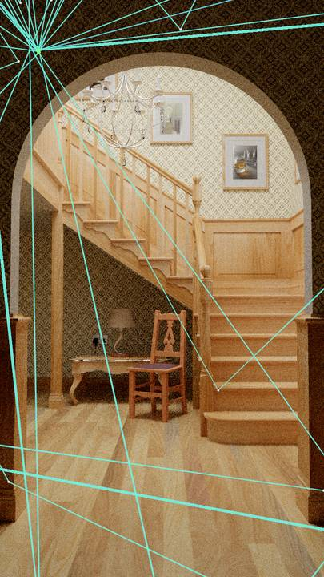

Two things put the lines in the room rather than on top of it. They are depth tested against the
gbuffer, so a segment running behind the newel post or under the stairs is hidden; and `thickness`
is a width in pixels *where a path starts*, which the rest of the path keeps in world units, so a
segment coming towards the camera thickens and a receding one thins without ever dropping below a
pixel.

The tolerance of the test is the local depth gradient, not a fraction of the depth: most of a path
lies *in* the surfaces it was sampled on — the chord between two hits on one wall is coplanar with
it — and at a grazing angle one pixel of rounding is already a large depth step.

Each segment is one quad, and the fragment measures its own distance to the segment: the edge is
antialiased, the taper is continuous, and the width costs almost nothing (64 paths draw in 0.03 ms
at 1280x720 on a mobile RTX 5070, 0.04 ms at eight pixels wide).

### Paths through a surface point

Clicking the floor resolves the surface behind that pixel; `restrict to: paths through the region`
then keeps every path with a segment inside the sphere. The other two region modes ask instead for
the path to *start* or *end* there.

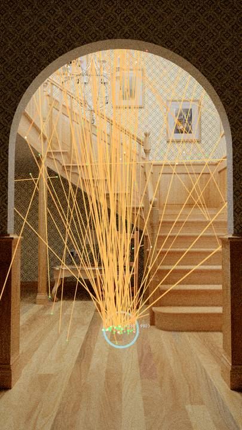

### Path expressions

The same scene under two expressions. `.*<T>.*` keeps the paths that refracted through the glass
egg — they pick it out of the room on their own:

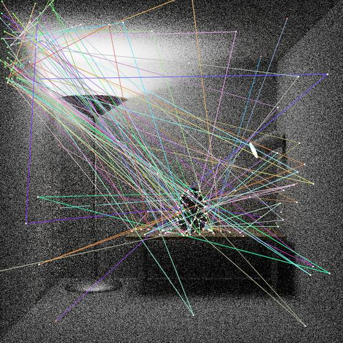

`.*[SG].*` instead keeps whatever bounced off a specular or glossy lobe, which here is the lamp's
reflector:

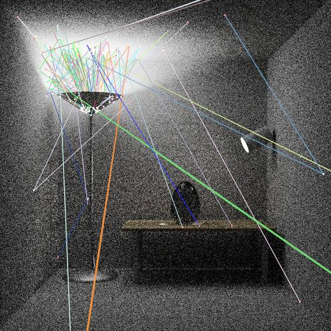

### Behind geometry

The depth test is what makes the egg read as a solid object above, and it necessarily hides the
transport *inside* it. `off (x-ray)` gives the same selection with every segment drawn:

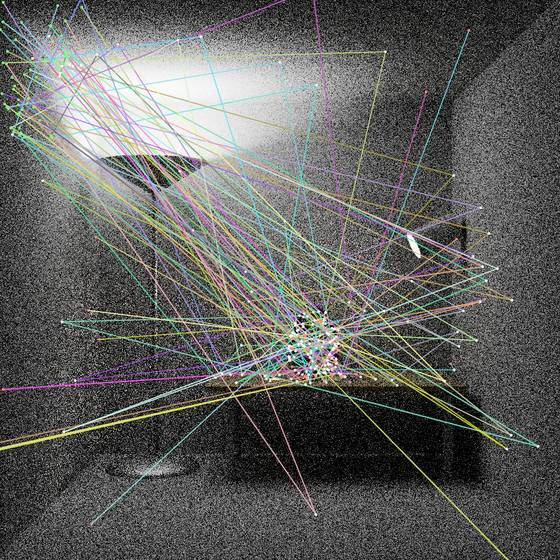

The three modes on the same paths, in a scene that is nothing but a floor, a back wall and one
panel standing between them and the camera. Segments running behind the panel vanish under `hide`
and come back dashed under `dash`; the ones in front of it — and the vertices sitting on it — are
untouched by either.

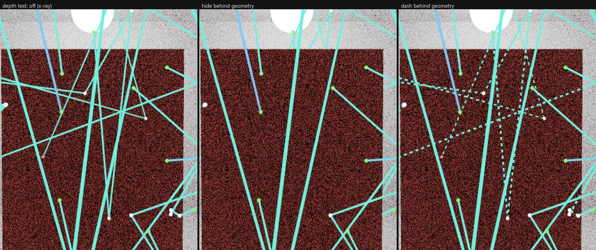

The class of an event is the lobe the renderer reported, so `S` only appears where a BSDF sampled
a true delta lobe; imported scenes that give everything a little roughness match `G` instead.

### Two classes of transport side by side

The backdrop can be rebuilt from the records alone. Here slot A is `.{1,2}` and slot B is `.{3,}`:
the short paths carry the directly lit floor, the long ones fill in the wallpaper, the alcove and
the ceiling.

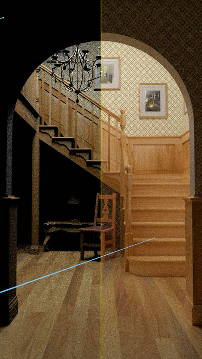

### Sampling analysis at a picked pixel

`restrict to: the picked pixel` narrows the selection to its paths and anchors the analysis. The
panels are, top to bottom, the sampled direction density, the BSDF pdf evaluated at that hit,
their ratio, and the Poisson z-score of the counts against the pdf. **chi2/dof ≈ 1 means the
sampler draws from the density it claims** — here 0.96 over 798 samples of one pixel.

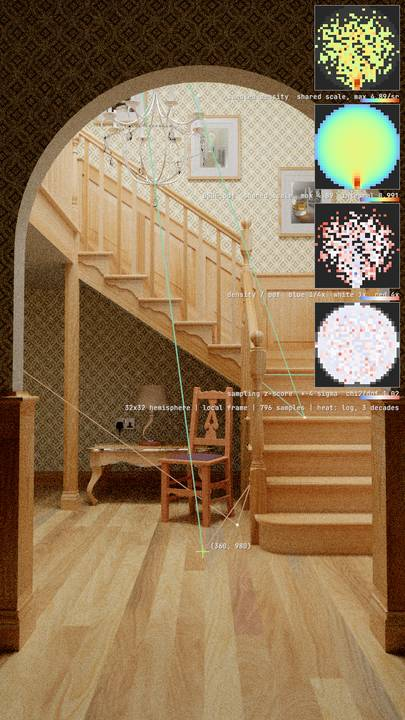

Panels share one scale where they are comparable, so agreeing distributions render as identical
images. `density / pdf` is white at ratio 1, blue undersampled, red oversampled; the z-score is
white within ±1 sigma and orange where a quasi-delta lobe was excluded from the test.

### BSDF validation

`check BSDF` also measures the identities a BSDF must satisfy, at the incident direction the
`BSDF` tab's picker sets: energy conservation, reciprocity, pdf normalization, `weight = eval /
pdf`, `sampled pdf = pdf()`, finiteness, and `get_albedo()` against the measured albedo. Each
reports `OK (number)` or `FAIL (reason)`. Two caveats are built in: the per-sample identities are
judged by the *share* of draws that miss them, since round-off explodes near a specular peak; and
the integrals report `n/a` below alpha 0.0225, where the quadrature grid cannot resolve the
lobe. 16.8M samples plus a 1024² full-sphere quadrature, one dispatch.

### The map on a sphere

Any map channel can be drawn on a sphere at the picked pixel's hit, which is easier to read than a
flat projection when you want to know *where in the room* a quantity points.

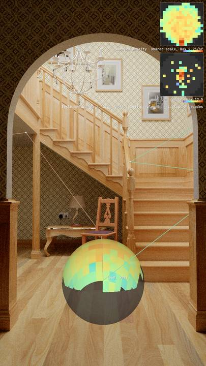

### World-space heat grid

Recorded vertices splatted into a hash grid and read back on the primary surfaces: warm where path
contribution concentrates, cool in the shadowed alcove.

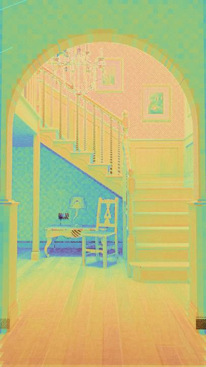

### Which pixels are still noisy

Per-pixel luminance moments over the records give a relative error per pixel. The dark alcove and
the wallpaper are still an order of magnitude noisier than the lit floor.

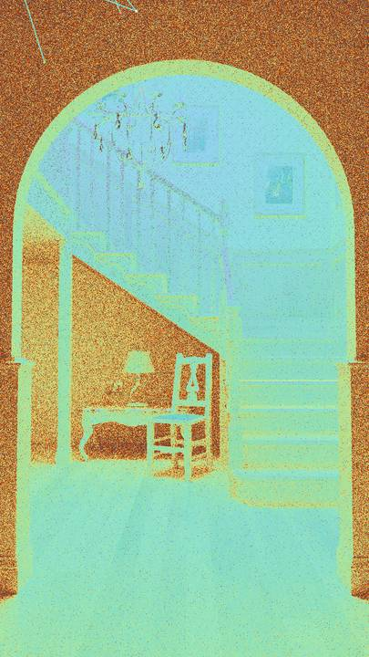

### Which technique sampled what

`method: guiding` keeps the paths a guided sampler steered. On veach-ajar they crowd the door gap,
which is what the guiding distribution is there to find.

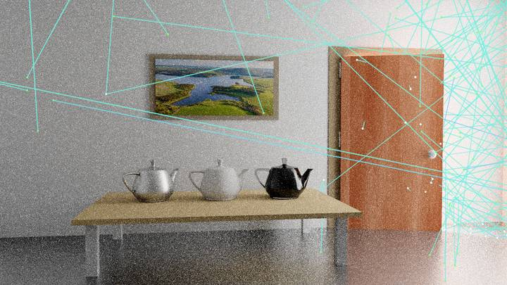

### Is it unbiased

That question belongs to the **Error Plot** node, which owns every reference-based metric: it
takes the reference from a connected image, an image on disk, or a snapshot of its own input, and
plots MSE / RMSE / MAE / relative MSE. On logarithmic axes it fits the slope, which is the whole
diagnostic - an unbiased estimator holds the Monte Carlo rate (-1/2 for RMSE and MAE, -1 for the
squared metrics) while one converging to a different image flattens onto its bias floor.
Converging a renderer you trust and snapshotting it turns the plot into a bias test with no file
in between, and `Convergence csv` writes the series out.

For comparing several methods at once, `scripts/eval.py` does it headlessly: it renders each
variant, captures at every power of two, and produces an image grid, convergence plots against
samples and against time, and a report.

## Reading the numbers

- **paths / vertices** — what the renderer recorded this frame. The stream is subsampled to fit its
  buffer; `keep probability` is adapted automatically, and every per-path estimate is normalised by
  it, so the counts are a sample, not the truth.
- **matched** — paths in the overlay's set, before the draw cap.
- **NEE connections** — recorded as branches off the vertex they connect from; a light draw that
  found no sample is recorded too, since it still counts as a draw. The directional maps bin one
  technique at a time: maps `draws` is `scatter directions` or `light connections`, the latter being
  the only draw of ReSTIR DI.
- **chi2/dof** — needs `restrict to: the picked pixel` and `bounce: 0`, so every draw shares one
  support. `BSDF pdf` compares scatter directions against the material; `recorded pdf` tests each
  sampler against the density it claims per sample (E[sum 1/pdf] = draws * omega per bin), which
  also works for guided and resampled samplers that have no closed-form pdf. A resampled sample
  records its contribution weight 1/W, for which the identity holds inside the target's support
  (Lin et al. 2022, GRIS): with light draws, bins on the edge of the observed support are left out.
  A bin the support covers only in part still reads low: the direct light of a surface next to an
  occluder is such a case, so test on a pixel that sees the lights unobstructed.
  A correct sampler gives chi2/dof = 1 with a standard deviation of sqrt(2 / dof), 1 ± 0.14 over
  100 bins; the value is green within 3 sigma, amber up to 5, red beyond. Far below 1 means the
  variance is overestimated.
- **batch means** — samples ReSTIR reuses across pixels or frames are correlated, so their variance
  comes from the residuals of consecutive `batch frames`-long batches instead, once 8 batches
  completed. A lag-1 correlation between batches above 0.2 means the batches are too short for the
  renderer's history: raise `batch frames`.
- **ReSTIR PT** — the renderer's `debugger records` chooses what it writes: `candidates` are the
  paths its initial pass traces, with their densities, so every analysis applies; `shaded paths`
  replays the path each pixel shades, as reconnection (orange) and replayed segments, for the
  overlay, the expressions and the inspector. Those carry no per-vertex density, only 1/W on the
  first vertex, so chi2 is off for them.
- **total variation** — the share of probability mass that would have to move to turn one
  distribution into the other: 0 % identical, 100 % disjoint. Sampling noise keeps it above zero,
  so read it as a trend over accumulation; chi2/dof is the noise-aware version of the same question.

## Costs

At 1920x1080 on an RX 7900 XTX: 0.37 ms over the whole image, 0.09 ms for one picked pixel, 0.83 ms
with both filter slots re-rendering. Recording adds about 0.5 ms to the path tracer; unconnected it
costs nothing.

Whole-image map scopes sample the stream (`analysis paths / frame`) instead of walking every
recorded vertex, and pause while neither panels, sphere nor the debugger window show them. The
per-pixel statistics run only while their overlay, the hover probe or the convergence tab reads
them. The heat grid is a fixed cost per frame in the grid size.
`picked pixel only` makes the sampling analysis converge in seconds but empties every
whole-image view.

The node itself holds ~150 MB at 1080p (the re-render, the moments, the maps and the heat grid)
plus the record stream, whose size is the renderer's capture budget (256 MB by default).

The re-rendered backdrop and the per-pixel statistics accumulate over frames — one frame of a
subsampled stream leaves most pixels empty — and reset whenever the selection changes.
